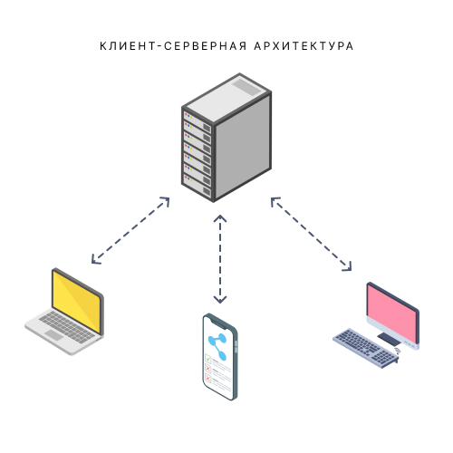
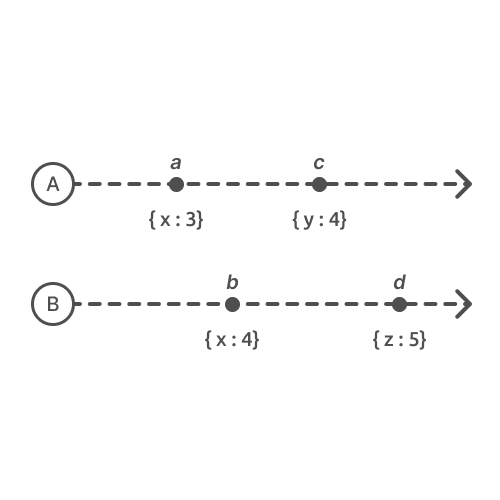
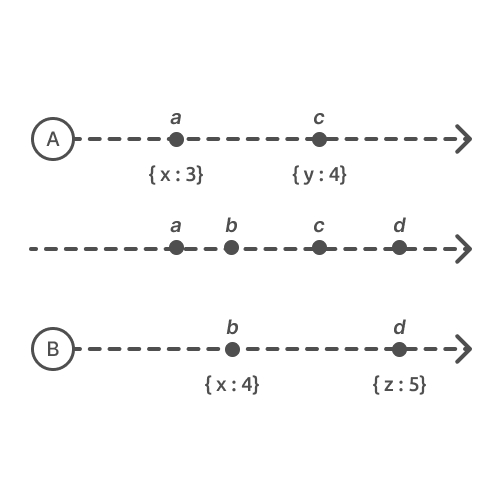
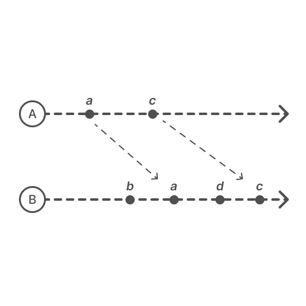
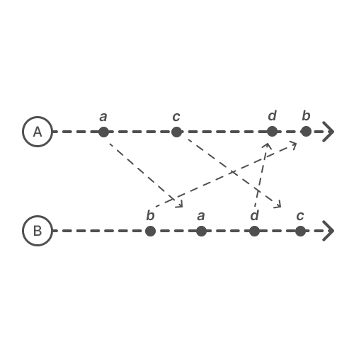
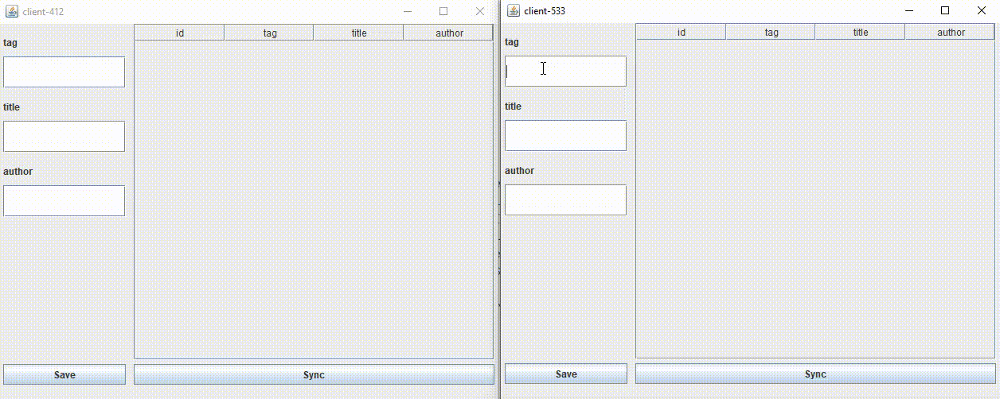

# CRDT

## Описание
В данном репозитории находится пример реализации бесконфликтно-реплицированных типов данных (CRDT) с использованием гибридных логических часов (HLC).
## Содержание
1. [Введение](#task1)
1. [Почему так мало offline first приложений?](#task2)
1. [Почему синхронизация - это сложно?](#task3)
1. [Как решить проблему упорядочивания событий?](#task4)
1. [Как решить конфликты?](#task5)
1. [Пример приложения](#task6)

### <a name="task1"></a> 1. Введение

На данный момент основным видом приложений являются веб-приложения. Веб-приложения используют в своей основе клиент-серверную архитектуру, и вся работа их построена на взаимодействии через интернет.



Главная проблема веб-приложений в том, что они не приспособлены для работы без интернета, а в случае плохого соединения их скорость отклика и производительность сильно ухудшается.

Решить данные проблемы можно с помощью подхода __**«сначала офлайн»**__, когда приложение создается для работы даже без подключения к сети, предоставляя клиентам возможность использовать приложение независимо от качества или наличия сети, сохраняя все пользовательские действия и синхронизируя их при появлении интернета. 

**Offline First** — это парадигма разработки приложений, при которой разработчики гарантируют, что на функциональность приложения не повлияет периодическое отсутствие сетевого подключения.

Автономная архитектура также предлагает такие преимущества, как снижение затрат на роуминг во время путешествий, минимизация использования данных на картах, экономия заряда батареи, а также ускорение загрузки. 

Все эти факторы формируют положительное отношение пользователя к приложению, что может служить конкурентным преимуществом.

### <a name="task2"></a> 2. Почему так мало offline first приложений?

На данный момент на рынке слабо представлены приложения, поддерживающие парадигму **Offline First**. Основная причина такой нераспространенности - сложность разработки, связанная с согласованностью данных. Конечно, если приложение полностью локальное, то проблем с согласованностью нет, но в ситуации, когда доступ к приложению возможен с разных устройств мы непременно сталкиваемся со сложностью синхронизации, поэтому неудивительно, что примерами таких приложений служат разработки крупных компаний, такие как Google Keep, Google Docs, Figma.


В данной ситуации необходимо признать, что любое офлайн приложение, которые подразумевает доступ с нескольких устройств - это **распределенная система**.
У вас может быть множество узлов - устройств с приложением - и при изменении состояния одного узла, необходимо, чтобы после подключения к сети изменения распространились на все устройства.

### <a name="task3"></a> 3. Почему синхронизация - это сложно?

Синхронизация вызывает сложности по двум причинам:
- Ненадежное упорядочивание
- Конфликты

При наличии двух устройств нам бы хотелось, чтобы изменения получаемые на эти устройства были упорядочены, но зачастую этого не происходит - т.к. время между моментом внесения изменений и моментом загрузки этих изменений на сервер может быть сколь угодно большим. Это можно проиллюстрировать следующим образом

Пусть у нас есть два устройства, на которых вносятся изменения



В идеальной системе мы бы хотели, чтобы при синхронизации события выстраивались в порядке внесения изменений




Однако в реальной системе мы имеем два различных устройства, которые выполняют отправку и получение изменений в абсолютно случайное время. Поэтому устройство `B` может получить изменения от `A` уже после внесения собственных изменений.



Аналогично устройство `A` может получить изменения от `B` в неправильном порядке.



Получение изменений в различном порядке означает, что мы не можем гарантировать, что состояние на устройствах после синхронизации будет одинаковым.

Для решения данной проблемы есть два подхода:
- Строгая согласованность (Strong Consistency), которая требует серьёзных ограничений в отношении масштабируемости и производительности приложений.
- Согласованность в конечном счете (Eventual Consistency), которая допускает различие состояний на устройствах

Согласованность в конечном счете признает факт наличия различных временных линий, распределенности системы и в отличие от строгой согласованности не борется с этим.

> **Главный вопрос Eventual Consistency**
> 
> Даже если мы получаем события в ином порядке - есть ли способ восстановить одинаковое состояние на каждом устройстве?


### <a name="task4"></a> 4. Как решить проблему упорядочивания событий?

Как упорядочить события?

1) **Использовать метки времени**
_Но время на различных устройствах может отличаться и в таком случае метки времени нам не нужны, нам нужен относительный порядок_

2) **Использовать идентификаторы (1, 2, 3...)**
_Но мы не можем просто использовать идентификаторы, т.к. тогда каждое устройство будет зависеть от глобального идентификаторы и это будет требовать строгой согласованности_

3) **Использовать специальные часы для синхронизации**

Существует много видов часов для синхронизации данных
- Часы Лэмпорта
- Векторные часы
- Гибридные логические часы

Каждые из этих часов основаны на том, что синхронизировать все узлы полностью невозможно, и поэтому множество событий рассматривается как **частично упорядоченное множество**.

Особый интерес из всех описанных часов вызывают гибридные логические часы (Hybrid Logical Clock), которые лишены недостатков остальных:
- В отличие от часов Лэмпорта гибридные логические часы близки к физическому времени
- В отличие от векторных часов их размер не зависит от количества узлов

#### Гибридные логические часы (HLC)

Данные часы существуют на каждом устройстве и тот факт, что они не являются централизованными, позволяет избежать ограничения строгой согласованности.

HLC генерируют метки времени, которые можно назначить каждому событию.

```
Пример временной метки
2022-05-09T10:42:13.572Z-0-client-887

```

Каждая метка времени, генерируемая HLC состоит из нескольких частей. Первая часть поддерживает максимально близкое значение к текущему системному времени, а вторая часть представляет собой логическую компоненту, используемую для сбора причинно-следственной связи в том случае, если первая часть временных меток совпала.

HLC позволяют нам по метке времени сравнить изменения и сказать произошло ли одно изменение раньше другого, т.е. благодаря данным часам мы можем восстановить относительный порядок.

### <a name="task5"></a> 5. Как решить конфликты?

До данного момента мы обсуждали проблемы, связанные с упорядочиванием, однако даже если события корректно упорядочены не исключена возможность возникновения конфликтов, когда, например, два пользователя в офлайне вносят изменения в один и тот же фрагмент, а после производят синхронизацию.

Существует несколько способов:

1) **Ручное разрешение конфликтов**. _Все ответственность за разрешение переносится на пользователя или разработчика. Данный подход крайне сложен в реализации, поскольку существует множество случаев, которые надо обработать._

2) **Использование бесконфликтно-реплицированных типов данных (CRDT)**


**Бесконфликтно-реплицированный тип данных (CRDT)** — это структура данных, упрощающая распределенные системы хранения данных и многопользовательские приложения.


Основными примерами реализации CRDT являются:

- G-Counter
- PN-Counter
- G-Set (Grow-only Set)
- LWW-Element-Set (Last-Write-Wins)
- OR-Set

CRDT имеет 2 главных свойства:

- **Коммутативность** (порядок не имеет значения)
- **Идемпотентность** (повторность не меняет состояния)

Таким образом, для CRDT не важно, в каком порядке и сколько раз вы применяете изменения - по своему определению CRDT гарантирует, что состояние на различных устройствах будет идентичным.

### <a name="task6"></a> 6. Пример приложения

В качестве примера, я разработал приложение, которое использует в своей основе бесконфликтно-реплицированный тип данных, а именно - реализация LWW-Map с применением G-Set на основе базы данных SQLite. 

Ключами в LWW-Map выступают гибридные метки времени, которые генерируются при каждом изменении и используются для упорядочивания. LWW-Map означает, что наибольший вес имеют изменения сделанные позже.

В отличие от обычной базы данных, для реализации CRDT необходимо отказаться от операции удаления - в этом заключается суть G-Set (Grow-Only Set). Мы назначаем специальную колонку, в которой помечаем удаленные строки, чтобы при распространении изменений на остальные устройства сообщить, что данные строки удалены. 

В основе приложения клиент-серверная архитектура - все клиенты общаются через сервер и у каждого клиента есть собственная база данных с сохраняемыми сообщениями. 

Пример использования



